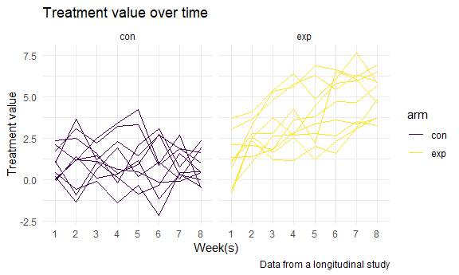

p8015_hw5_xz2981
================
Xinyan Zhou
11/17/2021

``` r
library(tidyverse)
```

    ## -- Attaching packages --------------------------------------- tidyverse 1.3.1 --

    ## v ggplot2 3.3.5     v purrr   0.3.4
    ## v tibble  3.1.4     v dplyr   1.0.7
    ## v tidyr   1.1.3     v stringr 1.4.0
    ## v readr   2.0.1     v forcats 0.5.1

    ## -- Conflicts ------------------------------------------ tidyverse_conflicts() --
    ## x dplyr::filter() masks stats::filter()
    ## x dplyr::lag()    masks stats::lag()

``` r
library(rvest)
```

    ## 
    ## Attaching package: 'rvest'

    ## The following object is masked from 'package:readr':
    ## 
    ##     guess_encoding

``` r
knitr::opts_chunk$set(
  fig.width = 6,
  fig.asp = .6,
  out.width = "90%"
)

theme_set(theme_minimal() + theme(legend.position = "bottom"))

options(
  ggplot2.continuous.colour = "viridis",
  ggplot2.continuous.fill = "viridis"
)

scale_colour_discrete = scale_colour_viridis_d
scale_fill_discrete = scale_fill_viridis_d
```

## Problem 1

Read in the data.

``` r
homicide_df = 
  read_csv("homicide_data/homicide-data.csv") %>% 
  mutate(
    city_state = str_c(city, state, sep = "_"),
    resolved = case_when(
      disposition == "Closed without arrest" ~ "unsolved",
      disposition == "Open/No arrest"        ~ "unsolved",
      disposition == "Closed by arrest"      ~ "solved",
    )
  ) %>% 
  select(city_state, resolved) %>% 
  filter(city_state != "Tulsa_AL")
```

    ## Rows: 52179 Columns: 12

    ## -- Column specification --------------------------------------------------------
    ## Delimiter: ","
    ## chr (9): uid, victim_last, victim_first, victim_race, victim_age, victim_sex...
    ## dbl (3): reported_date, lat, lon

    ## 
    ## i Use `spec()` to retrieve the full column specification for this data.
    ## i Specify the column types or set `show_col_types = FALSE` to quiet this message.

Let’s look at this a bit

``` r
aggregate_df = 
  homicide_df %>% 
  group_by(city_state) %>% 
  summarize(
    hom_total = n(),
    hom_unsolved = sum(resolved == "unsolved")
  )
```

Can I do a prop test for a single city?

``` r
prop.test(
  aggregate_df %>% filter(city_state == "Baltimore_MD") %>% pull(hom_unsolved), 
  aggregate_df %>% filter(city_state == "Baltimore_MD") %>% pull(hom_total)) %>% 
  broom::tidy()
```

    ## # A tibble: 1 x 8
    ##   estimate statistic  p.value parameter conf.low conf.high method    alternative
    ##      <dbl>     <dbl>    <dbl>     <int>    <dbl>     <dbl> <chr>     <chr>      
    ## 1    0.646      239. 6.46e-54         1    0.628     0.663 1-sample~ two.sided

Try to iterate ……..

``` r
results_df = 
  aggregate_df %>% 
  mutate(
    prop_tests = map2(.x = hom_unsolved, .y = hom_total, ~prop.test(x = .x, n = .y)),
    tidy_tests = map(.x = prop_tests, ~broom::tidy(.x))
  ) %>% 
  select(-prop_tests) %>% 
  unnest(tidy_tests) %>% 
  select(city_state, estimate, conf.low, conf.high)
```

``` r
results_df %>% 
  mutate(city_state = fct_reorder(city_state, estimate)) %>% 
  ggplot(aes(x = city_state, y = estimate)) +
  geom_point() + 
  geom_errorbar(aes(ymin = conf.low, ymax = conf.high)) + 
  theme(axis.text.x = element_text(angle = 90, vjust = 0.5, hjust = 1))
```


## Problem 2

Start with a dataframe containing all file names

``` r
list_id <- list.files('./data')

list_df =
  tibble(
    id = list_id
  )
```

Iterate over file names and read in data for each subject using
purrr::map and saving the result as a new variable in the dataframe

``` r
add = function(x) {
  
  path <- paste0("./data/", x)
  
  data <-
    read_csv(file = path) %>%
    mutate(id = x)
  
  return(data)
  
}

data_temp =
  tibble(
    data = map(list_df,add)
  )
```

    ## Rows: 20 Columns: 8

    ## -- Column specification --------------------------------------------------------
    ## Delimiter: ","
    ## dbl (8): week_1, week_2, week_3, week_4, week_5, week_6, week_7, week_8

    ## 
    ## i Use `spec()` to retrieve the full column specification for this data.
    ## i Specify the column types or set `show_col_types = FALSE` to quiet this message.

Tidy the result; manipulate file names to include control arm and
subject ID, make sure weekly observations are “tidy”, and do any other
tidying that’s necessary

``` r
data_new <-
  data_temp %>%
  unnest(data) %>%
  select(id,everything()) %>%
  separate(id,c("arm","other"),sep = "_") %>%
  separate(other,c("id","other"),sep = "[.]") %>%
  select(-other) %>%
  pivot_longer( 
    week_1:week_8,
    names_to = "weeks", 
    names_prefix = "week_",
    values_to = "value")

data_new
```

    ## # A tibble: 160 x 4
    ##    arm   id    weeks value
    ##    <chr> <chr> <chr> <dbl>
    ##  1 con   01    1      0.2 
    ##  2 con   01    2     -1.31
    ##  3 con   01    3      0.66
    ##  4 con   01    4      1.96
    ##  5 con   01    5      0.23
    ##  6 con   01    6      1.09
    ##  7 con   01    7      0.05
    ##  8 con   01    8      1.94
    ##  9 con   02    1      1.13
    ## 10 con   02    2     -0.88
    ## # ... with 150 more rows

Make a spaghetti plot showing observations on each subject over time,
and comment on differences between groups

``` r
data_new %>%
  ggplot(aes(x = weeks, y = value, group = id, color = arm)) +
  geom_line() +
  facet_grid(~arm) +
  labs(
    title = "Treatment value over time",
    x = "Week(s)",
    y = "Treatment value",
    caption = "Data from a longitudinal study"
  ) +
  theme_minimal()
```



In the control arm, we cannot find a clear pattern for the treatment
value over time. The value for each individual seems to fluctuate
randomly as the time changes. In the experimental arm, we can find a
clear pattern for the treatment value over time: for each individual,
the observed value increases as time goes by.

## Problem 3

``` r
set.seed(10)

iris_with_missing = iris %>% 
  map_df(~replace(.x, sample(1:150, 20), NA)) %>%
  mutate(Species = as.character(Species)) %>%
  janitor::clean_names()
```

Write a function that takes a vector as an argument

``` r
fill_missing = function(x) {
  
  if (is.numeric(x)) {
    x = replace(x, which(is.na(x)), mean(x, na.rm = TRUE))
    }
  
  else {x = ifelse(is.na(x), "virginica", x)}

  return(x)

}
```

Apply function to the columns of iris_with_missing using a map statement

``` r
output = map(iris_with_missing, fill_missing)

iris_no_missing = bind_rows(output)

iris_no_missing
```

    ## # A tibble: 150 x 5
    ##    sepal_length sepal_width petal_length petal_width species
    ##           <dbl>       <dbl>        <dbl>       <dbl> <chr>  
    ##  1         5.1          3.5         1.4         0.2  setosa 
    ##  2         4.9          3           1.4         0.2  setosa 
    ##  3         4.7          3.2         1.3         0.2  setosa 
    ##  4         4.6          3.1         1.5         1.19 setosa 
    ##  5         5            3.6         1.4         0.2  setosa 
    ##  6         5.4          3.9         1.7         0.4  setosa 
    ##  7         5.82         3.4         1.4         0.3  setosa 
    ##  8         5            3.4         1.5         0.2  setosa 
    ##  9         4.4          2.9         1.4         0.2  setosa 
    ## 10         4.9          3.1         3.77        0.1  setosa 
    ## # ... with 140 more rows
